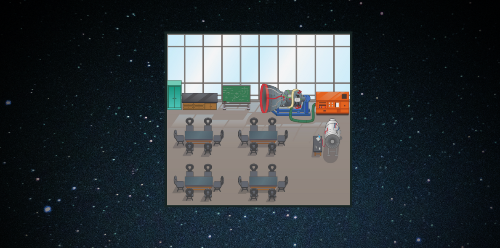

# 100 Roads Design

100 Roads has been designing and innovating in the education space since 2016. Our founder, Catherine Fraise, first designed a physical campus at Workspace Education in Bethel CT.

When lockdowns raised new problems, Catherine moved into developing online learning environments.

100 Roads Design is located in McLeod, Montana and our virtual campuses are created by a global team of digital architects, creatives, community builders and educators.

Learn more about us at https://100roadsdesign.com. 

## About the map

There are 14 virtual campuses in this repository.

Map name: Laws of the Universe.

Map name: Center for Aerodynamics.

Map name: Control Tower.

Map name: Hangar.

Map name: James Web Telescope.

Map name: JWT Classroom 1.

Map name: JWT Classroom 2.

Map name: Observatory.

Map name: Observatory Telescope.

Map name: Planetarium.

Map name: Rocket Training Center.

Map name: Rocketship.

Map name: Space Needle.

Map name: Spaceship.
## Copyright

This map is the sole property of 100 Roads Design LLC. All rights are reserved by 100 Roads Design LLC. All contents of the map may not be reproduced, distributed (for sale or otherwise), or create derivative works of the copyrighted work without the express written permission of 100 Roads Design LLC.